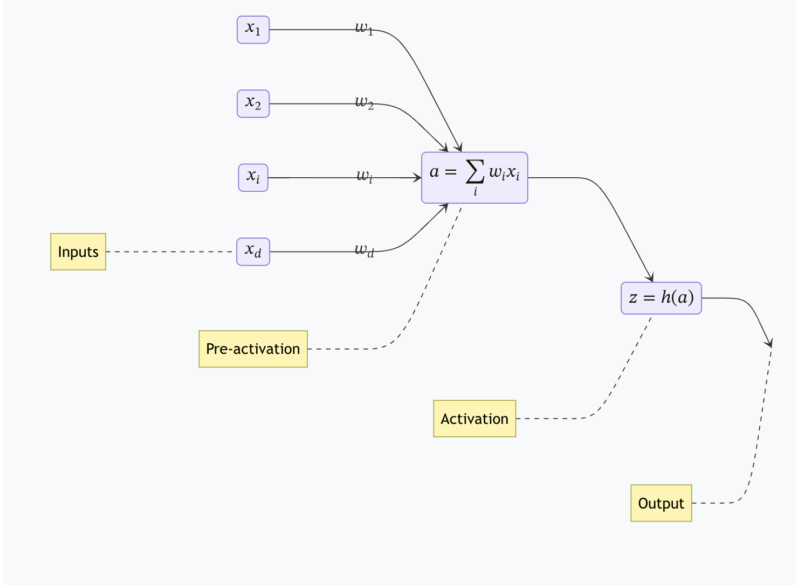

# Training neural networks

Vikas Chandrakant Raykar

[notes](https://vikasraykar.github.io/deeplearning/)

---

# Training neural networks

The goal of training is to find the value of the **parameters** of a **model** to make **effective predictions**.

We choose the model parameters by **optimizing** a **loss function**.

---

# Single Layer Networks

> For simplicity for this chapter we will mainly introduce single layer networks for regression and classification.

